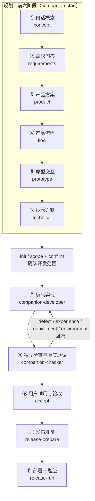
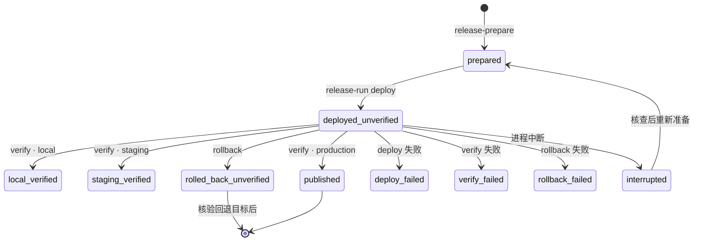
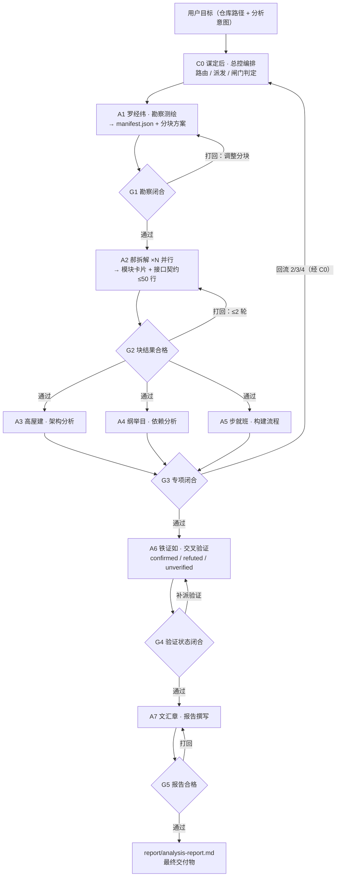
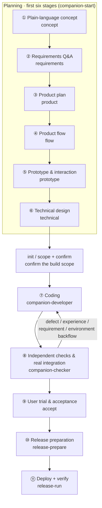
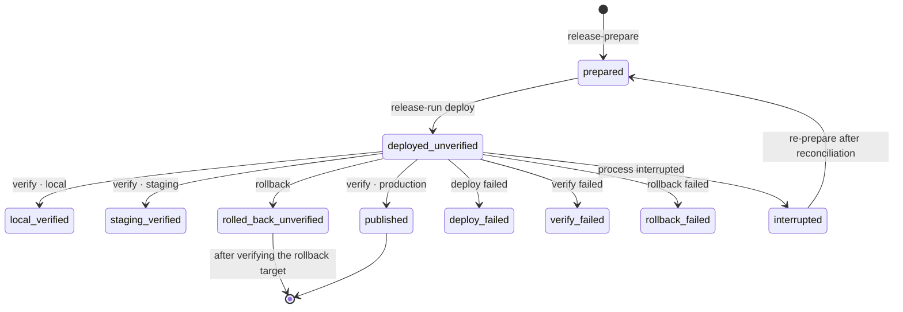
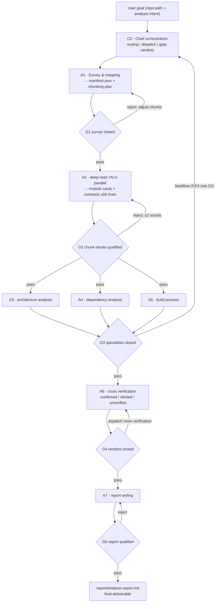

# agents · ZCode 智能体与插件集合 / ZCode Agent & Plugin Collection

[中文](#中文) | [English](#english)

ZCode 智能体与插件集合：**code-analysis-swarm**（只读代码分析智能团）+ **dev-companion**（面向新手的开发陪伴插件）。

A collection of ZCode agents and plugins: **code-analysis-swarm** (a read-only code-analysis agent team) + **dev-companion** (a beginner-oriented development companion plugin).

| 插件 Plugin | 版本 Version | 定位 Positioning |
|---|---|---|
| [code-analysis-swarm](#code-analysis-swarm--代码分析智能团) | 0.2.1 | 只读多智能体"全面体检"：结构、架构、依赖、构建，产出带 `file:line` 证据和覆盖声明的报告 |
| [dev-companion](#dev-companion--新手开发陪伴) | 0.2.0 | 从一句模糊想法到发布验证的完整生命周期：白话规划 → 串行开发 → 真实联调 → 独立验收 → 发布核验 → 本地快照 |

## 中文

本仓库是一个 ZCode 插件市场（根目录含 `marketplace.json`），包含两个独立插件。两者可单独安装：分析团负责**看清现状**，不承担开发；陪伴插件负责**做成产品**，可把分析报告作为输入，但不能把报告当成验收。

### 安装（ZCode 环境）

1. 准备本仓库的本地副本，确认仓库根目录有 `marketplace.json`。
2. 在 ZCode「插件市场 → 添加插件市场」选择该仓库根目录（不同宿主版本入口文字略有差异）。
3. 在该市场安装 `dev-companion` `0.2.0` 和 / 或 `code-analysis-swarm` `0.2.1`。已有安装先刷新市场，在插件详情里更新；**修改源码不会自动更新安装副本**。
4. 新建任务，在 `/` 菜单选择 `companion-start`（开发陪伴）或 `swarm-analyze`（代码分析）。

dev-companion 需要 Python 3.9+（仅标准库，无第三方依赖）和 ZCode 的文件 / 进程执行 / Agent 能力。没有必装 MCP、Hook、云服务或后台监控。`resume` 是 ZCode 内置命令，故插件入口统一以 `companion-` 前缀命名；用户自己的同名命令优先于插件命令。

---

### Dev Companion 0.2.0 · 新手开发陪伴

从一句模糊想法开始，用白话讲清产品，经过问答、产品方案、流程、原型和技术设计，再完成编码、联调、测试修复与发布验证。每一步保存成果、决定和未决问题，下次打开可以继续。详细说明见 [插件 README](dev-companion/README.md)。

#### 生命周期总览



前六阶段保存为规划记录（`journey.json`）；开发阶段使用功能台账（`state.json`）；每项功能从方案到接口、任务、检查始终沿用同一个编号。流程可按实际项目简化，但不能用一句"原型完成"代替实际产物；已有项目按当前事实补充所需设计，不推测历史阶段已完成。

#### 十一个阶段

| 阶段 | 帮你解决什么 | 留下什么 | 何时继续 |
|---|---|---|---|
| 1 白话概念 | 谁在什么场景遇到什么问题，软件能带来什么结果 | 概念卡、待澄清问题 | 关键概念清楚 |
| 2 需求问答 | 每轮问 1–3 个关键问题，允许"不知道，请推荐" | 优先级、约束、用户决定与明确标注的假设 | 首版方向明确 |
| 3 产品方案 | 确定首版功能、暂不包含的内容、怎样算做对 | 可确认的产品需求与验收例子 | 当前方案获得用户确认 |
| 4 产品流程 | 用户怎么开始、系统怎么回应、失败如何处理 | 主流程、关键分支、数据变化 | 核心功能形成完整路径 |
| 5 原型交互 | 提前走一遍真实操作，检查是否看得懂、用得顺 | 可打开的原型或真实模块操作样例、体验记录 | 关键操作可演示，结构问题得到处理 |
| 6 技术方案 | 明确文件范围、数据、接口、检查方法和发布目标 | 技术方案、接口约定、可执行任务范围 | 六阶段成果有效，并确认开发范围 |
| 7 编码实现 | 每次完成一项功能，保护已有工作 | 实际代码、测试、实现回报 | 产物可供独立检查 |
| 8 真实联调 | 连接真实界面、服务与数据；本地工具检查模块调用 | 真实接口或本地模块联调证据 | 成功及必要的失败路径通过 |
| 9 测试修复 | 独立检查、用户试用、归类问题、修复并重新验证 | 当前版本的检查与验收结果 | 阻断问题解决，必要试用通过 |
| 10 发布准备 | 明确版本、目标、部署与验证命令、回退方法 | 绑定当前成果的发布计划 | 当前功能全部验收，执行授权明确 |
| 11 发布验证 | 部署后检查实际目标上的版本和核心操作 | 本地验证、预发布验证或正式发布记录 | 对应环境的真实验证通过 |

#### 七个聊天入口

| 入口 | 你可以说 | 插件做什么 |
|---|---|---|
| `companion-start` | "我想做一个……" | 从概念问答推进到产品、流程、原型与技术方案 |
| `companion-progress` | "现在做到哪一步了？" | 分别展示阶段、功能验收、阻塞与发布状态 |
| `companion-work` | "继续做下一项" | 派发单项开发，安排独立功能检查和联调 |
| `companion-check` | "检查一下；试用时发现……" | 检查成果、归类反馈、修复后重新验收 |
| `companion-release` | "准备发布""验证已部署版本" | 保存发布计划，在授权范围执行部署、验证或回退 |
| `companion-archive` | "保存这些文件""先预览恢复" | 保存、查看快照，预览并确认恢复 |
| `companion-resume` | "接着上次继续" | 读取规划、实现、检查、发布与未决事项后续接 |

不为每个阶段新建 Agent；固定保留两个执行角色，另有三个按需设计角色（团队模式）：

- **companion-developer（开发者）**：根据已确认的单项任务包实现功能，限定 `allowed_paths` 文件范围，回报真实产物（`implemented` / `verified_existing` / `blocked`）。不替用户验收或发布，不顺便重构，不提交推送部署。
- **companion-checker（独立检查者）**：独立核对需求、流程、原型、真实功能与接口联调证据，运行 `check --kind feature` / `--kind integration`。不改产品代码，不以开发者自述代替检查，不替用户验收。
- **companion-product（产品与可行性）**：把模糊想法澄清为带证据的需求例子与范围界定（需求歧义时回流此角色）。
- **companion-design（UX/UI 设计）**：有界面 / 交互需求时产出并冻结版本化设计 brief。
- **companion-backend（后端 / 数据 / 接口）**：接口或数据设计时产出并冻结 API 契约（错误码、幂等、迁移）。

三个设计角色**按需引用，无相应需求不派发**；轻量模式（仅 developer + checker）完全保留，已有 `companion-*` 入口不变，不强制启用全部角色。设计 brief 与契约的联审不由产出者自审。

子代理不再派发子代理；角色不可用但 `Agent` 工具可用时，把角色全文交给 `general-purpose` 执行同一职责。

#### CLI 命令速查（scripts/companion.py）

所有项目事实记录只能通过 CLI 更新，禁止直接编辑状态文件补造进度：

```text
python3 "<插件根>/scripts/companion.py" --project "<项目绝对路径>" <子命令>
```

| 操作 | 接口 | 作用 |
|---|---|---|
| 检查环境 | `doctor` | 读取环境与记录存在情况，不证明模型接通 |
| 保存规划 | `plan --stage STAGE --input PATH --revision N [--complete] [--user-confirmed]` | 保存六阶段草案或当前有效成果 |
| 查看规划 | `planning-status` | JSON：`record` 为规划状态，无记录时为 null |
| 建立开发草案 | `init --input PATH` | 保存完整技术 scope，不等于确认 |
| 确认开发范围 | `confirm --revision N` | 使用当前 state revision 确认范围 |
| 修改开发范围 | `scope --input PATH --revision N` | 更新技术范围，再按实际授权确认 |
| 查看进度 | `status --format markdown` | 展示阶段、功能验收、发布与下一步 |
| 读取状态 | `status --format json` | 获取当前 state revision 和事实字段 |
| 生成静态看板 | `status --format html --out PATH` | 写展示文件（建议 `.dev-companion/board.html`），不改变完成度 |
| 派发任务 | `packet --feature ID` | 开始一次功能执行，返回任务包及规划 / 接口上下文 |
| 导入回报 | `receipt --input PATH` | 实现只到待检查，或记录受阻 |
| 功能检查 | `check --feature ID --kind feature` | 运行当前范围内的功能检查 |
| 真实联调 | `check --feature ID --kind integration` | 运行 technical 接口的联调命令 |
| 反馈回流 | `feedback --feature ID --kind KIND --note TEXT` | 记录问题并使该功能需要处理和重新检查 |
| 接受成果 | `accept --feature ID --note TEXT [--user-confirmed]` | 要求当前成功检查与必要的真实用户反馈 |
| 记录受阻 | `block --feature ID --reason TEXT` | 保存具体原因，不删除未完成项 |
| 准备发布 | `release-prepare --input PATH --revision N` | 将具体发布计划绑定当前已验收成果 |
| 核对中断发布 | `release-reconcile --revision N --note TEXT --authorized` | 确认实际目标与进程已停止后记录 interrupted |
| 清理失效写锁 | `recover-lock --authorized` | 仅在已确认写入停止且锁中 PID 不存在时清理（仅 POSIX） |
| 查看发布 | `release-status` | JSON：`record` 为发布记录，无记录时为 null |
| 执行发布操作 | `release-run --action deploy\|verify\|rollback --revision N --authorized` | 仅执行已获具体授权的操作 |
| 保存文件 | `save --paths PATH... --summary TEXT` | 显式选择普通文件制作本地快照 |
| 查看快照 | `history` | 查看已有快照与范围 |
| 恢复预览 | `preview-restore --archive ID` | 获取增改删清单及新令牌 |
| 执行恢复 | `restore --archive ID --token TOKEN` | 确认同一预览且已停止写入后恢复 |

`STAGE` ∈ concept / requirements / product / flow / prototype / technical；`KIND`（反馈）∈ defect / experience / requirement / environment。退出码：`0` 成功；`2` 参数 / 状态 / 权限错误；`3` 实际检查或发布命令失败。发布命令每条上限 120 秒、输出最多保存 64 KiB，入库前遮盖常见密钥形态。完整契约见 [CLI 约定](dev-companion/references/cli-contract.md)，输入示例见 [生命周期输入](dev-companion/references/lifecycle-inputs.md)。

#### 三种记录与版本

| 记录 | 文件 | 版本读取 | 首次写入 |
|---|---|---|---|
| 产品规划 | `.dev-companion/journey.json`（schema 1） | `planning-status` 的 `record.revision` | `plan --revision 0` |
| 功能执行 | `.dev-companion/state.json`（schema 1） | `status --format json` 的 `revision` | `init` |
| 发布 | `.dev-companion/release.json`（schema 1） | `release-status` 的 `record.revision` | `release-prepare --revision 0` |

三者 revision 独立，不能混用。规划、功能完成度和发布分开记录；本地、预发布和正式环境分开表述。规划或上游成果变化会使下游旧成果需要复查；代码、需求、接口或检查依据变化也会使旧检查和发布计划失效。

#### 发布状态机



进程在 deploy / verify / rollback 执行中被中断时，记录停留在 deploying / verifying / rolling_back；核对实际目标与进程、确认已停止后用 `release-reconcile` 记为 interrupted，再重新准备或按具体授权回退，禁止自动重放。

| 实际状态 | 含义 |
|---|---|
| 产品方案已确认 | 确定要做什么，还没有证明代码可用 |
| 开发者报告实现 | 产物已提交，等待独立检查 |
| 功能与联调检查通过 | 约定命令实际通过，还需核对覆盖及必要试用 |
| 已验收 100% | 当前功能范围全部验收，还需单独完成发布 |
| 部署成功、待验证 | 部署命令结束，尚未确认目标环境可用 |
| 本地验证通过 / 预发布验证通过 | 只证明对应环境，不表示正式上线 |
| 正式发布通过 | 正式环境部署后的约定验证通过 |
| 已回退、待验证 | 回退命令结束，仍需检查回退后的实际服务 |

发布使用项目已经明确的部署、验证与回退命令（argv 数组），不自动创建服务器、购买服务或修改账号；`--authorized` 是调用者对已有用户授权的声明。秘密通过环境或既有安全配置传入，不写进 JSON、命令参数或日志。

#### 完成度与反馈

- 功能完成度 = 已验收功能 / 当前确认范围的全部功能，各项等权；范围未确认不显示虚构百分比，受阻项仍在分母，规划阶段数量不算功能完成度，100% ≠ 已发布。
- 反馈四分类：**defect** 回实现；**experience** 回流程 / 原型；**requirement** 回需求（须实际改变功能或产品语义）；**environment** 回环境。记录反馈前先实际停止相关任务，改状态不等于停止进程；不通过删除受阻功能提高完成度，不无限重试同一失败。

#### 本地文件快照

只保护**显式纳管**的普通文件（单文件 ≤20 MiB、累计 ≤100 MiB、最多 10000 个），不保存 Git 历史、数据库或线上服务。恢复前实际停止所有写入 → `preview-restore` 展示增改删预览 → 用户确认该次预览 → 用预览返回的新令牌 `restore` → 核实自动生成的保护快照。失败保留故障现场，不能报告恢复成功。撤回恢复同样针对保护快照重新预览确认。

#### 示例

- **最小演示**：`dev-companion/examples/demo-project/` 是已实现的最小 Python 支出合计示例（`scope.json` 为需求输入），复制到空目录后可观察"待确认 → 待检查 → 独立检查 → 用户验收"全流程。见 [示例说明](dev-companion/examples/README.md)。
- **完整生命周期演示**：从仓库根运行 `python3 -B dev-companion/examples/lifecycle_demo.py`，会创建隔离目录，实际走完 23 步真实 CLI：早期草案、六阶段规划、开发回报、故意失败后的修复、功能与 HTTP 联调检查、验收及本地发布验证，输出状态板与网页启动命令，每步回执保留在 `.dev-companion/demo-evidence/`。这是自动化演示（`local_verified`、`human_trial=false`），不代替真实用户试用。

#### 实施与验证状态（2026-09-20）

已验证：Python 主测试 **564 通过**（另 5 项 L_TIER 长跑基准门在常规 discover 中 skip）、最小示例 **4/4**、Node **57/57**（工作流 54 + 宿主契约 3，模拟宿主）；0.2.0 里程碑 trace 覆盖 core 94% / journey 100% / releases 99% / archives 89%（见实施记录）；L 档 10 万条目基准实测见 [L 档验收](docs/verification/l-tier-acceptance-2026-09-20.md)；23 步隔离项目演示到 `local_verified`，代理浏览器核验部署副本；真实派发 `companion-developer` 修复 + `companion-checker` 独立检查在桌面环境通过。尚未验证：**真实用户的需求问答、原型体验与软件试用**；正式远程部署（示例本地发布不代表任意云平台已适配）。细节见 [生命周期实施记录](docs/dev-companion-lifecycle.md) 与 [阶段验证记录](docs/verification/)；旧版本历史见 [既有评审](docs/dev-companion-review.md)。

---

### code-analysis-swarm 0.2.1 · 代码分析智能团

对目标软件做**全面体检**的只读多智能体体系：代码结构、模块划分、整体架构、依赖关系、构建流程。产出带证据（`file:line`）的中文分析报告。完整设计见 [`code-analysis-swarm/DESIGN.md`](code-analysis-swarm/DESIGN.md)。

#### 八角色星型编排



一切跨角色信息经总控 C0 中转（星型编排），成员之间不直连；A2 各块并行、A3/A4/A5 三个专项并行，A7 必须串行在最后。

| 代号 | 角色 | 姓名 | 输入 | 输出 |
|------|------|------|------|------|
| C0 | 总控编排 | 谋定后 | 用户目标 | 通道选型、任务分派、黑板维护、门禁判定、交付总结 |
| A1 | 勘察测绘 | 罗经纬 | 仓库根路径 | `manifest.json`（语言统计 / 入口 / 构建文件 / 分块方案） |
| A2 | 模块深读 ×N | 郝拆解 | 块文件闭集 + 邻块契约 | `chunks/chunk-XX.json` + `interfaces/` 契约摘要（≤50 行） |
| A3 | 架构分析 | 高屋建 | 合并模块清单（**不读原始代码**） | `specialty/architecture.md`（分层 Mermaid 图 / 模式判定 / 数据流） |
| A4 | 依赖分析 | 纲举目 | manifest + 依赖边 + 包清单 | `specialty/dependency.md` + 内部 / 外部依赖 CSV（热点 / 循环 / CVE 标记） |
| A5 | 构建流程 | 步就班 | 构建文件 + CI 配置 | `specialty/build.md`（管线阶段 / 工具链 / 环境差异 / 可复现性；默认 `executed: false`） |
| A6 | 交叉验证 | 铁证如 | 高价值结论样本（**与被验证者零共享上下文**） | `verification/verdicts.json`（每条恰好一个 verdict） |
| A7 | 报告撰写 | 文汇章 | 全部黑板产物 + 验证结论（**只组织不新造**） | `report/analysis-report.md` |

#### 七条设计原则

1. **制品即接口**：角色间传类型化制品（JSON/CSV/MD，统一 snake_case），schema 即契约。
2. **星型编排**：跨角色信息一律经 C0 中转；点对点澄清是例外通道。
3. **证据强制**：写入报告的结论必须带 `file:line`（或命令输出）+ 严重度 + 置信度；没证据的只能进"待验证"区。
4. **传契约不传代码**：块间只共享 ≤50 行接口契约摘要；上下文预算花在自己块的深读上。
5. **闸门硬性化**：每道闸门是可机械判定的条件（字段齐全 / 证据非空 / 覆盖闭合）。
6. **验证独立**：A6 与被验证者不共享上下文——重查，不是复述；refuted 结论保留并标注，不静默删除。
7. **按需裁剪**：8 角色是能力全集，小仓库不跑全套（见路由）。

#### 五道闸门

| 闸门 | 判定条件 | 不通过时 |
|------|---------|---------|
| G1 勘察闭合 | chunks 文件并集 = 源文件全集（无重复 / 漏项 / 越界）；每块 ≤5k LOC 且 ≤150 文件；按规模分块不截断 | 打回 A1 调整分块 |
| G2 块结果合格 | chunk JSON 字段齐全（snake_case）；逐文件 analyzed_files 与闭集一致、gaps 为空；findings / edges 有来源；模块名跨块唯一；契约路径正确 | 打回对应 A2 实例（≤2 轮） |
| G3 专项闭合 | 架构引用模块 ∈ 模块全集；依赖边两端可归位；构建文件全覆盖 | 按回流通道 2/3/4 退回 |
| G4 验证完成 | 高严重度结论 + 入口判定 + 全部专项 claims 100% 有独立 verdict（不截取前 N 条）；confirmed / refuted 各有独立证据；无法查证标 unverified | 补派验证 |
| G5 报告合格 | 报告含 0–8 全部章节 + 完整覆盖声明 + 全部送验状态；refuted 不删除，unverified 不计为 verified | 打回 A7 |

门禁失败最多纠正两轮；仍失败交付 blocked / partial 及证据缺口，不声明"全面分析完成"。

#### 决策三级与回流

- **L1 自决**（自己拍板记录后继续）：如 A1 分块边界、A2 模块粒度、A5 阶段划分、A6 复查方法。
- **L2 协商**（退回对应角色或 C0 协调）：如 A2 发现分块错误退回 A1；A4 发现边指向不存在模块退回 A3/A2。
- **L3 升级**（流程暂停等用户裁决）：仓库不可读 / 混淆加壳、范围超预算、**高危安全发现（后门 / CVE）**、A5 实际执行构建（须 C0 批准且只在副本目录）。

六条回流通道（指定退回目标 + 携带证据，不允许"这里不对，你们看看"）：① A2 分块错误→A1；② A3 模块冲突→C0 归并；③ A4 边失效→A3/A2；④ A5 入口不符→A1；⑤ A6 refuted→原产出角色；⑥ A7 制品缺口→C0 补派。

#### 五条工作流路由

| 场景 | 判定条件 | 通道 |
|------|---------|------|
| 小仓库 | ≤10 个源文件 | ⚡ 快速：A1（轻）→ A2 单实例 → A6 → A7（证据与报告结构不简化） |
| 中型仓库 | 两者之间 | 🏗️ 标准 SOP：全链路 8 角色 + 五道闸门 |
| 大仓库 | >100 文件 或 >50k LOC | 🌊 工作流通道：DWF 并行 + 机械门禁（宿主已注册时） |
| 单维分析 | 只要依赖 / 只要构建 | 📋 单维：只调度相关角色，其余标注未覆盖 |
| 复析已有仓库 | 黑板已存在 | 🔄 增量：新建 run_id；当前实现全量重跑 |

**默认倾向：宁轻勿重。** 快速通道能解决的绝不跑标准 SOP。

#### 黑板（按运行隔离的制品目录）

```
<output_root>/<run_id>/          # 必须在目标仓库和插件目录之外；新 run_id 排他创建，禁止覆盖
├── manifest.json                # A1：全局图 + 分块方案
├── chunks/chunk-XX.json         # A2：模块卡片 / 依赖边 / 发现
├── interfaces/<chunk_id>/*.md   # A2：对外契约摘要（≤50 行）
├── graph/internal-deps.csv      # A4：内部依赖边
├── graph/external-deps.csv      # A4：外部依赖表
├── specialty/{architecture,dependency,build}.md   # A3/A4/A5
├── verification/verdicts.json   # A6：confirmed / refuted / unverified
└── report/analysis-report.md    # A7：最终交付物
```

#### 最终报告结构（A7 产出，C0 验收）

```
0. 元信息：日期、commit/版本、覆盖统计、通道与方法、黑板路径
1. 执行摘要（≤1 页）：做什么、技术栈、规模、架构一句话定性、健康度结论
2. 代码库全景：带注释目录树、语言构成表
3. 模块清单：每模块一张卡片（职责/入口/接口/依赖/模式/风险）
4. 架构分析：分层 Mermaid 图、模式判定+依据、典型数据流、一致性
5. 依赖分析：内部图+热点+循环依赖；外部依赖表（版本/许可证/漏洞标记）
6. 构建流程：管线阶段图、工具链、环境差异、产物、可复现性
7. 发现与风险：按严重度排序，每条带 file:line 证据 + 验证状态
8. 覆盖声明：分析了什么、没分析什么、为什么（绝不留白）
附录：分块方案、验证记录
```

#### 使用

```
/swarm-analyze D:\projects\my-app                # 按实际规模选择分析路径
/swarm-analyze D:\projects\my-app 只要依赖和构建   # 单维分析
/swarm-analyze D:\projects\my-app 重新分析        # 建立新的运行记录
```

动态工作流 `workflow/code-analysis.dwf.ts` 是**可选**路径（参数 `target` / `team_root` / `output_root` / `run_id`），只有宿主实际注册并验证 DWF 时才使用；没有 DWF 时按命令执行手动 SOP，保持相同制品与门禁。Node 测试（工作流 54 项 + 宿主契约 3 项，共 57 项）用模拟宿主验证其分派与结构拒绝逻辑，不替代真实 DWF 验收。

#### 硬约束速览

- 对目标仓库**零写操作**；构建默认静态分析（`executed: false`，未执行 ≠ 构建通过）
- 一切结论必须带 `file:line` 证据；A2 只读块内闭集禁止漫游；A3 不接触原始代码
- 验证员与被验证者不共享上下文；refuted 保留标注，unverified 如实声明
- 报告必须含「覆盖声明」；CVE 判断保守，查不实标"待查证"，不编 CVE 号
- 不自动写 `.toh/memory` 或任何全局记忆；运行记录保留在本次黑板
- `complete` 仅表示本次分析结构闭合，不代表产品需求完成、测试通过或软件可上线

---

### 仓库结构

```
agents/
├── marketplace.json                    # ZCode 插件市场清单（仓库根即市场根）
├── code-analysis-swarm/                # 插件：只读代码分析智能团 0.2.1
│   ├── .zcode-plugin/plugin.json       # commands 字段显式声明目录名 command/（单数，合法自定义）
│   ├── README.md                       # 插件视角简明说明（安装 / 组件 / 命令 / 测试）
│   ├── DESIGN.md                       # 完整设计（角色 / 闸门 / 契约 / 报告结构）
│   ├── agents/                         # a1-scout ~ a7-reporter 七个角色提示词
│   ├── command/swarm-analyze.md        # /swarm-analyze 入口（C0 操作手册）
│   ├── scripts/precheck.py             # 预检与制品核验 helper（标准库，工作流经固定 argv 调用）
│   └── workflow/code-analysis.dwf.ts   # 可选动态工作流
├── dev-companion/                      # 插件：新手开发陪伴 0.2.0
│   ├── .zcode-plugin/plugin.json
│   ├── README.md                       # 新手使用说明
│   ├── commands/                       # 七个 companion-* 聊天入口（目录名为 manifest 显式声明）
│   ├── skills/dev-companion/SKILL.md   # 共享技能（生命周期流程）
│   ├── agents/                         # developer / checker 两固定角色 + product / design / backend 三按需设计角色
│   ├── references/                     # cli-contract / lifecycle-inputs / zcode-integration 等
│   ├── scripts/                        # companion.py + core/journey/releases/archives + _kernel_vendor/
│   └── examples/                       # demo-project 最小示例 + lifecycle_demo 完整演示
├── packages/agents_kernel/             # 两插件共享内核（单源，仅标准库）：domain / execution / indexing / services / storage
├── tools/                              # build_vendor.py（内核分发复制）+ command_registry.py（命令注册表生成）
├── docs/                               # 实施记录 / verification 阶段验证 / host-contract 宿主探针 / audit 审计基线 / command-registry.md
└── tests/                              # Python 回归 + Node 工作流与宿主契约测试 + benchmarks（L 档基准）
```

### 本地验证

从仓库根运行：

```sh
python3 -m unittest discover -s tests -v                                    # Python 回归：564 项（L_TIER 门未设环境变量时 skip 5 项）
node --test tests/swarm_workflow.test.mjs tests/host/host-contract.test.mjs # Node：57 项（工作流 54 + 宿主契约 3）
python3 -m unittest discover -s dev-companion/examples/demo-project -v      # 最小示例：4 项
python3 tools/command_registry.py --check                                   # 命令注册表与命令文件一致（docs/command-registry.md）
```

修改 `packages/agents_kernel` 后须重建插件内 vendor 副本（副本禁手改，由脚本哈希校验）：

```sh
python3 tools/build_vendor.py
```

L 档（10 万条目）容量基准不进常规回归，手动运行：`L_TIER=1 python3 -m unittest tests.benchmarks.test_l_tier -v`。

Python 测试覆盖规划草案与失效、状态、完成度、接口检查、发布证据、范围变更、文件快照与恢复故障，另含共享内核（索引、分片、覆盖账、恢复）与团队编排回归。Node 测试需要 Node 24，执行 TypeScript 工作流的真实编排逻辑并模拟宿主返回；它不替代真实 ZCode 动态工作流验收。

### 文档索引

| 文档 | 内容 |
|---|---|
| [dev-companion/README.md](dev-companion/README.md) | 新手使用说明（阶段表 / 入口 / 反馈 / 发布 / 快照） |
| [dev-companion/references/cli-contract.md](dev-companion/references/cli-contract.md) | CLI 命令与状态约定（22 个子命令全表） |
| [dev-companion/references/lifecycle-inputs.md](dev-companion/references/lifecycle-inputs.md) | 六阶段与发布的完整 JSON 输入示例 |
| [dev-companion/references/zcode-integration.md](dev-companion/references/zcode-integration.md) | ZCode 接入约定与两插件协作分工 |
| [code-analysis-swarm/README.md](code-analysis-swarm/README.md) | 分析团插件说明（安装 / 组件 / 命令目录 / 测试） |
| [code-analysis-swarm/DESIGN.md](code-analysis-swarm/DESIGN.md) | 分析团完整设计 |
| [docs/command-registry.md](docs/command-registry.md) | 全部聊天命令注册表（自动生成，`tools/command_registry.py --check` 校验） |
| [docs/verification/](docs/verification/) | 阶段验证记录（L 档基准 / 宿主 E2E / 团队端到端等） |
| [docs/dev-companion-lifecycle.md](docs/dev-companion-lifecycle.md) | 0.2.0 生命周期实施与验证记录 |
| [docs/dev-companion-review.md](docs/dev-companion-review.md) | 既有评审与旧版验证历史 |

## English

This repository is a ZCode plugin marketplace (the repo root contains `marketplace.json`) with two independent plugins. They can be installed separately: the swarm **sees the current state** and never develops; the companion **builds the product** and may use the swarm's reports as input — but a report never counts as acceptance.

### Installation (ZCode environment)

1. Prepare a local copy of this repository and make sure the repo root contains `marketplace.json`.
2. In ZCode's "Plugin Marketplace → Add marketplace", pick this repository root (wording may differ between host versions).
3. Install `dev-companion` `0.2.0` and/or `code-analysis-swarm` `0.2.1` from that marketplace. For existing installs, refresh the marketplace and update from the plugin detail page; **editing the source does not auto-update the installed copy**.
4. Start a new task and pick `companion-start` (development companion) or `swarm-analyze` (code analysis) from the `/` menu.

dev-companion requires Python 3.9+ (standard library only, no third-party packages) and ZCode's file / process-execution / Agent capabilities. There is no required MCP, hook, cloud service, or background monitoring. `resume` is a built-in ZCode command, so plugin entries use the `companion-` prefix; the user's own commands with the same name take precedence over plugin commands.

---

### Dev Companion 0.2.0 · Beginner Development Companion

Start from one vague sentence, explain the product in plain language, go through Q&A, the product plan, flows, a prototype and the technical design, then finish coding, integration, test-and-fix and release verification. Every step saves its results, decisions and open questions so you can continue next time. See the [plugin README](dev-companion/README.md) for details.

#### Lifecycle overview



The first six stages are saved as planning records (`journey.json`); development uses the feature ledger (`state.json`); every feature keeps one ID from plan to interface, task and check. The process can be simplified per project, but a sentence like "prototype done" never replaces a real artifact; existing projects add only the design they need, starting from current facts — past stages are never assumed complete.

#### Eleven stages

| Stage | What it solves for you | What it leaves behind | When to move on |
|---|---|---|---|
| 1 Plain-language concept | Who hits what problem in which scenario, and what the software achieves | Concept card, open questions | Key concepts are clear |
| 2 Requirements Q&A | 1–3 key questions per round; "I don't know, please recommend" is allowed | Priorities, constraints, user decisions and clearly labeled assumptions | First-version direction is set |
| 3 Product plan | First-version features, explicit non-goals, what "done" means | Confirmable product requirements and acceptance examples | The user confirmed the plan |
| 4 Product flow | How users start, how the system responds, how failures are handled | Main path, key branches, data changes | Core features form a complete path |
| 5 Prototype & interaction | Walk the real operations in advance; check clarity and flow | An openable prototype or a real module-operation sample, experience notes | Key operations are demonstrable, structural issues handled |
| 6 Technical design | File scope, data, interfaces, check methods, release target | Technical plan, interface contracts, executable task scope | Six-stage results are valid and the build scope is confirmed |
| 7 Coding | One feature at a time, protecting existing work | Real code, tests, the developer's report | Artifacts ready for independent check |
| 8 Real integration | Wire real UI, services and data; local tools check module calls | Evidence from real interfaces or local module calls | Success plus required failure paths pass |
| 9 Test & fix | Independent checks, user trial, issue triage, fix and re-verify | Current version's check and acceptance results | Blocking issues resolved, required trial passed |
| 10 Release preparation | Version, target, deploy/verify commands, rollback method | A release plan bound to current results | All features accepted, execution authorization clear |
| 11 Release verification | Check the real target's version and core operations after deploy | Local / staging / production release records | The corresponding environment's real verification passed |

#### Seven chat entries

| Entry | You say | The plugin does |
|---|---|---|
| `companion-start` | "I want to build…" | Moves from concept Q&A through product, flow, prototype and technical plan |
| `companion-progress` | "Where are we now?" | Shows stage, feature acceptance, blockers and release status separately |
| `companion-work` | "Continue with the next one" | Dispatches one feature, arranges independent checks and integration |
| `companion-check` | "Check it; during the trial I found…" | Checks results, triages feedback, re-accepts after fixes |
| `companion-release` | "Prepare a release" / "verify the deployed version" | Saves the release plan; deploys, verifies or rolls back within authorization |
| `companion-archive` | "Save these files" / "preview the restore first" | Saves and lists snapshots, previews and confirms restores |
| `companion-resume` | "Continue from last time" | Reads planning, implementation, checks, releases and open questions, then continues |

No new Agent per stage; two fixed execution roles plus three on-demand design roles (team mode):

- **companion-developer**: implements one confirmed task package, restricted to `allowed_paths`, reports real artifacts (`implemented` / `verified_existing` / `blocked`). Never accepts on the user's behalf, never refactors on the side, never commits, pushes or deploys.
- **companion-checker**: independently verifies requirements, flows, the prototype, real features and integration evidence; runs `check --kind feature` / `--kind integration`. Does not modify product code, does not take the developer's word for a check, does not accept or release.
- **companion-product** (product & feasibility): turns a vague idea into evidence-backed requirement examples and scope (requirement ambiguity flows back here).
- **companion-design** (UX/UI): produces and freezes a versioned design brief when there is UI / interaction work.
- **companion-backend** (backend / data / interfaces): produces and freezes API contracts (error codes, idempotency, migration) when interface or data design is needed.

The three design roles are **referenced on demand only — never dispatched without a matching need**; the lightweight mode (developer + checker only) is fully preserved, existing `companion-*` entries unchanged, and no role is mandatory. Design briefs and contracts are cross-reviewed by someone other than their author.

Subagents never spawn subagents; when a role is unavailable but the `Agent` tool exists, the role's full prompt is handed to `general-purpose` to perform the same duty.

#### CLI quick reference (scripts/companion.py)

All project facts are updated only through the CLI — state files must never be hand-edited to fake progress:

```text
python3 "<plugin root>/scripts/companion.py" --project "<absolute project path>" <subcommand>
```

| Action | Interface | Purpose |
|---|---|---|
| Check environment | `doctor` | Reads environment and record existence; does not prove the model works |
| Save planning | `plan --stage STAGE --input PATH --revision N [--complete] [--user-confirmed]` | Saves a six-stage draft or the currently valid result |
| View planning | `planning-status` | JSON: `record` is the planning state, null when absent |
| Create dev draft | `init --input PATH` | Saves the full technical scope; not a confirmation |
| Confirm build scope | `confirm --revision N` | Confirms the scope at the current state revision |
| Change build scope | `scope --input PATH --revision N` | Updates the technical scope, then confirm per real authorization |
| View progress | `status --format markdown` | Shows stage, feature acceptance, release and next step |
| Read status | `status --format json` | Gets the current state revision and fact fields |
| Render static board | `status --format html --out PATH` | Writes a display file (suggested `.dev-companion/board.html`); never changes completion |
| Dispatch a task | `packet --feature ID` | Starts one feature run; returns the task package with planning/interface context |
| Import a report | `receipt --input PATH` | Implementation only reaches "pending check", or is recorded as blocked |
| Feature check | `check --feature ID --kind feature` | Runs the in-scope feature checks |
| Real integration | `check --feature ID --kind integration` | Runs the technical interfaces' integration commands |
| Feedback backflow | `feedback --feature ID --kind KIND --note TEXT` | Records the issue and marks the feature as needing work and re-check |
| Accept results | `accept --feature ID --note TEXT [--user-confirmed]` | Requires current successful checks and, when needed, real user feedback |
| Record blocker | `block --feature ID --reason TEXT` | Saves the concrete reason without deleting the unfinished item |
| Prepare release | `release-prepare --input PATH --revision N` | Binds a concrete release plan to the currently accepted results |
| Reconcile interrupted release | `release-reconcile --revision N --note TEXT --authorized` | Records `interrupted` after the real target and processes are confirmed stopped |
| Clean a stale write lock | `recover-lock --authorized` | Only when writes are confirmed stopped and the lock's PID no longer exists (POSIX only) |
| View release | `release-status` | JSON: `record` is the release record, null when absent |
| Run a release action | `release-run --action deploy\|verify\|rollback --revision N --authorized` | Runs only the specifically authorized action |
| Save files | `save --paths PATH... --summary TEXT` | Makes a local snapshot of explicitly chosen ordinary files |
| List snapshots | `history` | Lists existing snapshots and their scope |
| Preview restore | `preview-restore --archive ID` | Returns the add/replace/delete list and a fresh token |
| Perform restore | `restore --archive ID --token TOKEN` | Restores after the same preview is confirmed and writes have stopped |

`STAGE` ∈ concept / requirements / product / flow / prototype / technical; `KIND` (feedback) ∈ defect / experience / requirement / environment. Exit codes: `0` success; `2` argument / status / permission error; `3` a real check or release command failed. Release commands cap at 120 s each and 64 KiB of saved output; common secret shapes are masked before being recorded. Full contract: [CLI contract](dev-companion/references/cli-contract.md); input examples: [lifecycle inputs](dev-companion/references/lifecycle-inputs.md).

#### Three records and their revisions

| Record | File | Revision source | First write |
|---|---|---|---|
| Product planning | `.dev-companion/journey.json` (schema 1) | `planning-status` → `record.revision` | `plan --revision 0` |
| Feature execution | `.dev-companion/state.json` (schema 1) | `status --format json` → `revision` | `init` |
| Release | `.dev-companion/release.json` (schema 1) | `release-status` → `record.revision` | `release-prepare --revision 0` |

The three revisions are independent and never interchangeable. Planning, feature completion and release are recorded separately; local, staging and production environments are described separately. When upstream results change, downstream results need re-checking; changes to code, requirements, interfaces or check criteria also invalidate old checks and release plans.

#### Release state machine



When a process is interrupted during deploy / verify / rollback, the record stays in deploying / verifying / rolling_back; after the real target and processes are confirmed stopped, `release-reconcile` records `interrupted` — then re-prepare or roll back under specific authorization. Automatic replay is forbidden.

| Actual state | Meaning |
|---|---|
| Product plan confirmed | What to build is decided; the code is not yet proven to work |
| Developer reports implemented | Artifacts submitted, waiting for independent check |
| Feature & integration checks passed | The agreed commands really passed; coverage and required trial still need review |
| Accepted 100% | The current feature scope is fully accepted; release is still a separate step |
| Deployed, unverified | The deploy command finished; the target's availability is unconfirmed |
| Local / staging verified | Proves only that environment, not production |
| Published | The agreed verification passed on the production target |
| Rolled back, unverified | The rollback command finished; the rolled-back service still needs checking |

Releases use commands the project has already defined (argv arrays) — no automatic server creation, service purchase or account changes; `--authorized` is the caller's declaration that the user already authorized this action. Secrets flow in via environment or existing secure configuration, never into JSON, command arguments or logs.

#### Completion & feedback

- Feature completion = accepted features / all features in the confirmed scope, equal weights; no invented percentage before the scope is confirmed, blocked features stay in the denominator, planning-stage counts never mix into feature completion, and 100% ≠ released.
- Four feedback kinds: **defect** → back to implementation; **experience** → back to flow/prototype; **requirement** → back to requirements (must actually change a feature or the product's semantics); **environment** → environment. Stop the actually-running tasks before recording feedback — changing a status is not stopping a process; completion is never raised by deleting blocked features, and the same failure is never retried forever.

#### Local file snapshots

Only **explicitly managed** ordinary files are protected (≤20 MiB per file, ≤100 MiB total, ≤10,000 files); Git history, databases and online services are never included. Restore flow: actually stop all writers → `preview-restore` shows the add/replace/delete preview → the user confirms that exact preview → `restore` with the fresh token from the preview → verify the auto-generated protective snapshot. Failures keep the scene and are never reported as success. Undoing a restore re-previews and re-confirms against the protective snapshot as well.

#### Examples

- **Minimal demo**: `dev-companion/examples/demo-project/` is an implemented minimal Python expense-sum example (`scope.json` is its requirement input). Copy it to an empty folder to observe the full "unconfirmed → pending check → independent check → user acceptance" flow. See the [examples README](dev-companion/examples/README.md).
- **Full lifecycle demo**: run `python3 -B dev-companion/examples/lifecycle_demo.py` from the repo root. It creates an isolated directory and really executes 23 CLI steps: early drafts, six-stage planning, development reports, a deliberate failure and its fix, feature and HTTP integration checks, acceptance and a local release verification — printing a status board and a web start command, with every step's receipt kept in `.dev-companion/demo-evidence/`. This is an automated demo (`local_verified`, `human_trial=false`) and does not replace a real user trial.

#### Implementation & verification status (2026-09-20)

Verified: Python main suite **564 passed** (5 more L_TIER long-run benchmark gates skip in a normal discover), minimal demo **4/4**, Node **57/57** (workflow 54 + host contract 3, mock host); 0.2.0-milestone trace coverage core 94% / journey 100% / releases 99% / archives 89% (see the implementation record); the L-tier 100k-entry benchmark has been physically measured ([L-tier acceptance](docs/verification/l-tier-acceptance-2026-09-20.md)); the 23-step isolated demo reached `local_verified` with the deployed copy checked by an agent browser; real dispatch of `companion-developer` + independent `companion-checker` passed on desktop. Not yet verified: **a real user's requirement Q&A, prototype experience and software trial**; a real remote deployment (the example's local release does not mean any cloud platform is adapted). Details: [lifecycle implementation record](docs/dev-companion-lifecycle.md) and [per-phase verification records](docs/verification/); the old version's history: [previous review](docs/dev-companion-review.md).

---

### code-analysis-swarm 0.2.1 · Code Analysis Swarm

A read-only multi-agent system that gives target software a **full checkup**: code structure, module division, overall architecture, dependency relations, build process. It produces Chinese-language analysis reports backed by `file:line` evidence. Full design: [`code-analysis-swarm/DESIGN.md`](code-analysis-swarm/DESIGN.md).

#### Eight roles in a star topology



All cross-role information flows through C0 (star orchestration); members never connect directly. A2's chunks run in parallel, A3/A4/A5 run in parallel, and A7 is always last.

| Code | Role | Name | Input | Output |
|------|------|------|-------|--------|
| C0 | Chief orchestration | 谋定后 | User goal | Route selection, dispatch, blackboard upkeep, gate verdicts, delivery summary |
| A1 | Survey & mapping | 罗经纬 | Repo root | `manifest.json` (language stats / entry points / build files / chunking plan) |
| A2 | Module deep-read ×N | 郝拆解 | The chunk's closed file set + neighbor contracts | `chunks/chunk-XX.json` + `interfaces/` contract summaries (≤50 lines) |
| A3 | Architecture analysis | 高屋建 | Merged module list (**never reads raw code**) | `specialty/architecture.md` (layered Mermaid diagram / pattern verdicts / data flows) |
| A4 | Dependency analysis | 纲举目 | manifest + dependency edges + package lists | `specialty/dependency.md` + internal/external dep CSVs (hotspots / cycles / CVE flags) |
| A5 | Build process | 步就班 | Build files + CI config | `specialty/build.md` (pipeline stages / toolchain / env differences / reproducibility; default `executed: false`) |
| A6 | Cross verification | 铁证如 | High-value conclusion sample (**zero shared context with the verified**) | `verification/verdicts.json` (exactly one verdict per claim) |
| A7 | Report writing | 文汇章 | All blackboard artifacts + verdicts (**organizes only, invents nothing**) | `report/analysis-report.md` |

#### Seven design principles

1. **Artifacts are the interface**: roles exchange typed artifacts (JSON/CSV/MD, snake_case throughout); the schema is the contract.
2. **Star orchestration**: all cross-role traffic is relayed by C0; point-to-point clarification is the exception channel.
3. **Evidence mandatory**: every report conclusion carries `file:line` (or command output) + severity + confidence; unevidenced judgments only go to the "to be verified" area.
4. **Contracts, not code**: chunks share only ≤50-line interface contract summaries; the context budget is spent deep-reading one's own chunk.
5. **Hard gates**: every gate is a mechanically decidable condition (fields complete / evidence non-empty / coverage closed).
6. **Independent verification**: A6 shares no context with the verified role — re-checking, not paraphrasing; refuted conclusions are kept and labeled, never silently deleted.
7. **Trim on demand**: the 8 roles are the full capability set; small repos do not run everything (see routing).

#### Five gates

| Gate | Condition | On failure |
|------|-----------|-----------|
| G1 survey closed | chunks' file union = the full source set (no duplicates / omissions / escapes); each chunk ≤5k LOC and ≤150 files; chunked by size, never truncated | Back to A1 to adjust chunking |
| G2 chunk results qualified | chunk JSON fields complete (snake_case); per-file analyzed_files matches the closed set with empty gaps; findings / edges sourced; module names unique across chunks; contract paths correct | Back to the responsible A2 instance (≤2 rounds) |
| G3 specialties closed | Modules referenced by architecture ∈ module set; dependency edges resolve on both ends; all build entry files covered | Backflow channels 2/3/4 |
| G4 verdicts closed | High-severity findings + entry verdicts + all specialty claims 100% have an independent verdict (no truncation); confirmed / refuted each carry their own evidence; unverifiable marked unverified | Dispatch more verification |
| G5 report qualified | All sections 0–8 present + a complete coverage statement + every verdict state; refuted not deleted, unverified never counted as verified | Back to A7 |

Gates allow at most two correction rounds; beyond that the run is delivered as blocked / partial with its evidence gaps — never declared a "complete analysis".

#### Decision levels and backflow

- **L1 self-decide** (decide, record, continue): e.g. A1's chunk boundaries, A2's module granularity, A5's stage division, A6's re-check method.
- **L2 negotiate** (return to the responsible role or C0): e.g. A2 returns a mis-chunked block to A1; A4 returns edges pointing to nonexistent modules to A3/A2.
- **L3 escalate** (pause for the user): unreadable / obfuscated repos, scope over budget, **high-risk security findings (backdoors / CVEs)**, and A5 actually executing a build (requires C0 approval and happens only in a copy directory).

Six backflow channels (a named target + evidence — never "this looks wrong, you guys look at it"): ① A2 chunking error → A1; ② A3 module conflicts → C0 to merge; ③ A4 dangling edges → A3/A2; ④ A5 entry mismatch → A1; ⑤ A6 refuted → the producing role; ⑥ A7 artifact gaps → C0 to re-dispatch.

#### Five workflow routes

| Scenario | Condition | Route |
|------|-----------|-------|
| Small repo | ≤10 source files | ⚡ Fast: A1 (light) → single A2 → A6 → A7 (evidence rules and report structure never simplified) |
| Medium repo | in between | 🏗️ Standard SOP: all 8 roles + five gates |
| Large repo | >100 files or >50k LOC | 🌊 Workflow: DWF parallelism + mechanical gates (when the host registered it) |
| Single dimension | dependencies only / build only | 📋 Single-dim: only the relevant roles; the rest marked not covered |
| Re-analysis | blackboard exists | 🔄 Incremental: a fresh run_id; the current implementation re-runs everything |

**Default bias: lighter over heavier.** If the fast route can do it, the standard SOP never runs.

#### Blackboard (a per-run isolated artifact directory)

```
<output_root>/<run_id>/          # outside the target repo and the plugin dir; fresh run_id, exclusively created, never overwritten
├── manifest.json                # A1: global map + chunking plan
├── chunks/chunk-XX.json         # A2: module cards / edges / findings
├── interfaces/<chunk_id>/*.md   # A2: outbound contract summaries (≤50 lines)
├── graph/internal-deps.csv      # A4: internal dependency edges
├── graph/external-deps.csv      # A4: external dependency table
├── specialty/{architecture,dependency,build}.md   # A3/A4/A5
├── verification/verdicts.json   # A6: confirmed / refuted / unverified
└── report/analysis-report.md    # A7: final deliverable
```

#### Final report structure (written by A7, accepted by C0)

```
0. Meta: date, commit/version, coverage stats, route & method, blackboard path
1. Executive summary (≤1 page): what it does, stack, size, one-line architecture verdict, health conclusion
2. Repository panorama: annotated directory tree, language table
3. Module list: one card per module (responsibility / entry / interface / deps / patterns / risk)
4. Architecture: layered Mermaid diagram, pattern verdict + rationale, typical data flows, consistency
5. Dependencies: internal graph + hotspots + cycles; external table (version / license / vulnerability flags)
6. Build: pipeline stage diagram, toolchain, environment differences, artifacts, reproducibility
7. Findings & risks: sorted by severity, each with file:line evidence + verdict state
8. Coverage statement: what was analyzed, what was not, and why (never blank)
Appendix: chunking plan, verification records
```

#### Usage

```
/swarm-analyze D:\projects\my-app                # picks the analysis route by actual size
/swarm-analyze D:\projects\my-app dependencies and build only   # single-dimension analysis
/swarm-analyze D:\projects\my-app re-analyze      # starts a new run record
```

The dynamic workflow `workflow/code-analysis.dwf.ts` is an **optional** path (params `target` / `team_root` / `output_root` / `run_id`), used only when the host has actually registered and verified DWF; without DWF the command runs the manual SOP with identical artifacts and gates. The Node tests (workflow 54 + host contract 3 = 57) verify its dispatch and structure-rejection logic against a mock host and do not replace real DWF acceptance.

#### Hard constraints at a glance

- **Zero write operations** on the target repo; builds are analyzed statically by default (`executed: false`; not executed ≠ build passed)
- Every conclusion carries `file:line` evidence; A2 reads only its chunk's closed set (no roaming); A3 never touches raw code
- Verifier and verified share no context; refuted results are kept and labeled; unverified is declared honestly
- Reports must include a "coverage statement"; CVE judgments stay conservative — unverifiable is marked "to be verified", CVE IDs are never invented
- Never auto-writes `.toh/memory` or any global memory; run records stay in that run's blackboard
- `complete` means only that this analysis is structurally closed — never that product requirements are done, tests passed, or the software is shippable

---

### Repository layout

```
agents/
├── marketplace.json                    # ZCode plugin marketplace manifest (repo root = marketplace root)
├── code-analysis-swarm/                # Plugin: read-only code analysis swarm 0.2.1
│   ├── .zcode-plugin/plugin.json       # its commands field explicitly declares the singular command/ dir
│   ├── README.md                       # Plugin-level quick guide (install / components / commands / tests)
│   ├── DESIGN.md                       # Full design (roles / gates / contracts / report structure)
│   ├── agents/                         # a1-scout ~ a7-reporter role prompts
│   ├── command/swarm-analyze.md        # /swarm-analyze entry (C0 operation manual)
│   ├── scripts/precheck.py             # precheck & artifact verification helper (stdlib, fixed argv)
│   └── workflow/code-analysis.dwf.ts   # Optional dynamic workflow
├── dev-companion/                      # Plugin: beginner development companion 0.2.0
│   ├── .zcode-plugin/plugin.json
│   ├── README.md                       # Beginner guide
│   ├── commands/                       # Seven companion-* chat entries (dir name declared in the manifest)
│   ├── skills/dev-companion/SKILL.md   # Shared skill (lifecycle process)
│   ├── agents/                         # developer / checker fixed roles + product / design / backend on-demand roles
│   ├── references/                     # cli-contract / lifecycle-inputs / zcode-integration etc.
│   ├── scripts/                        # companion.py + core/journey/releases/archives + _kernel_vendor/
│   └── examples/                       # demo-project minimal demo + lifecycle_demo full demo
├── packages/agents_kernel/             # Shared kernel for both plugins (single source, stdlib only): domain / execution / indexing / services / storage
├── tools/                              # build_vendor.py (kernel vendor copy) + command_registry.py (command registry generator)
├── docs/                               # Implementation records / verification per phase / host-contract probes / audit baselines / command-registry.md
└── tests/                              # Python regression + Node workflow & host-contract tests + benchmarks (L-tier)
```

### Local verification

From the repository root, run:

```sh
python3 -m unittest discover -s tests -v                                    # Python regression: 564 tests (5 L_TIER gates skip without the env var)
node --test tests/swarm_workflow.test.mjs tests/host/host-contract.test.mjs # Node: 57 tests (workflow 54 + host contract 3)
python3 -m unittest discover -s dev-companion/examples/demo-project -v      # Minimal demo: 4 tests
python3 tools/command_registry.py --check                                   # Command registry matches the command files (docs/command-registry.md)
```

After changing `packages/agents_kernel`, rebuild the in-plugin vendor copy (never hand-edited; hash-verified by the script):

```sh
python3 tools/build_vendor.py
```

The L-tier (100k-entry) capacity benchmark stays out of the normal regression; run it manually with `L_TIER=1 python3 -m unittest tests.benchmarks.test_l_tier -v`.

The Python tests cover planning drafts and invalidation, status, completion, interface checks, release evidence, scope changes, file snapshots, and restore failures, plus shared-kernel (indexing, sharding, coverage ledger, recovery) and team-orchestration regression. The Node test requires Node 24 and executes the real orchestration logic of the TypeScript workflow with simulated host returns; it does not replace real ZCode dynamic-workflow acceptance.

### Documentation index

| Document | Contents |
|---|---|
| [dev-companion/README.md](dev-companion/README.md) | Beginner guide (stage table / entries / feedback / release / snapshots) |
| [dev-companion/references/cli-contract.md](dev-companion/references/cli-contract.md) | CLI command & status contract (full 22-subcommand table) |
| [dev-companion/references/lifecycle-inputs.md](dev-companion/references/lifecycle-inputs.md) | Complete JSON input examples for the six stages and releases |
| [dev-companion/references/zcode-integration.md](dev-companion/references/zcode-integration.md) | ZCode integration conventions and how the two plugins divide work |
| [code-analysis-swarm/README.md](code-analysis-swarm/README.md) | Swarm plugin guide (install / components / command dir / tests) |
| [code-analysis-swarm/DESIGN.md](code-analysis-swarm/DESIGN.md) | Full swarm design |
| [docs/command-registry.md](docs/command-registry.md) | Registry of all chat commands (generated; verified by `tools/command_registry.py --check`) |
| [docs/verification/](docs/verification/) | Per-phase verification records (L-tier benchmark / host E2E / team end-to-end etc.) |
| [docs/dev-companion-lifecycle.md](docs/dev-companion-lifecycle.md) | 0.2.0 lifecycle implementation & verification record |
| [docs/dev-companion-review.md](docs/dev-companion-review.md) | Previous review and the old version's verification history |
